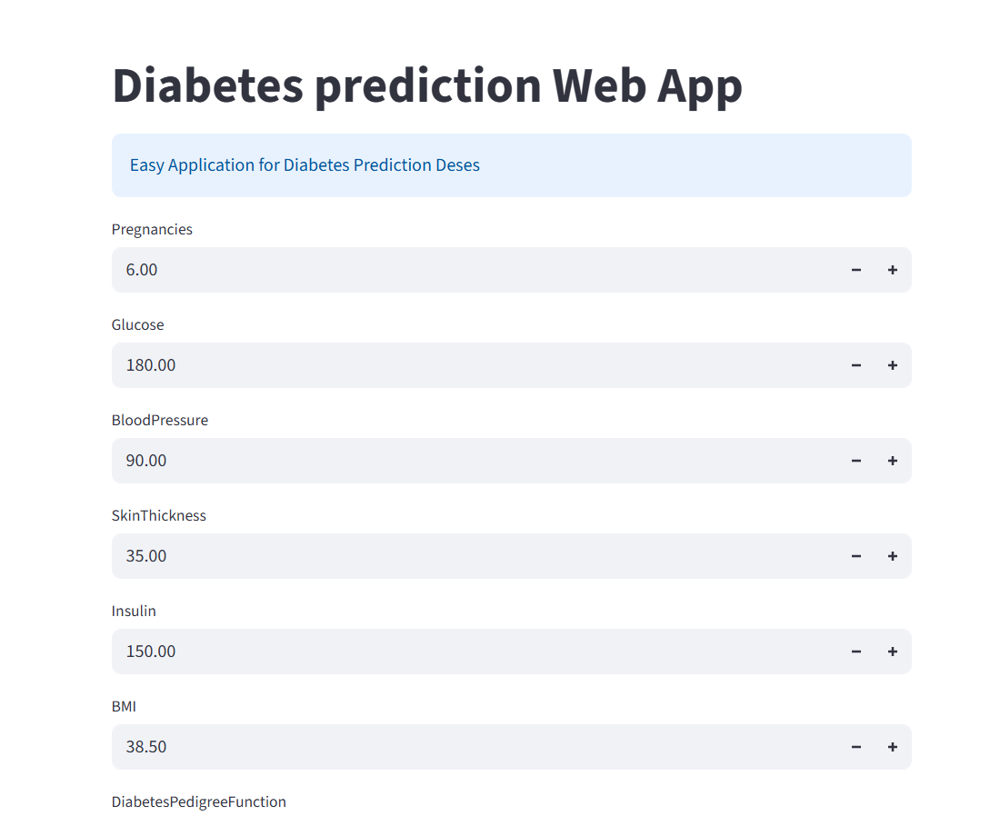
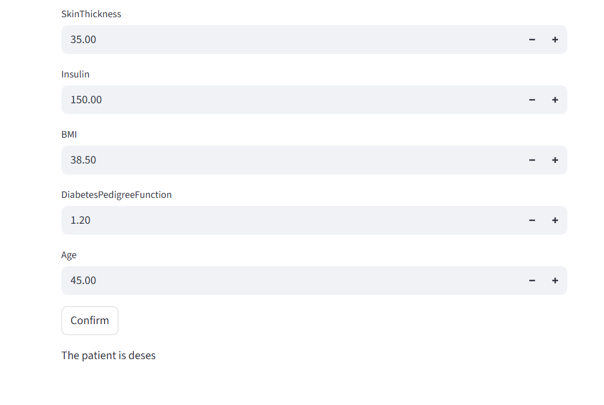

# Diabetes Prediction System

## Overview

This project is a complete end-to-end Machine Learning system that predicts whether a patient is likely to have diabetes based on medical attributes.

The system includes:

* Data analysis and preprocessing
* Model training and evaluation
* Interactive dashboard using Streamlit
* REST API using FastAPI

---

## Features

* Predict diabetes based on patient data
* Clean and structured ML pipeline
* Interactive UI for easy usage
* API ready for integration with any frontend

---

## Model Performance

* Accuracy: **90%**
* Evaluation Metrics:

  * F1 Score
  * Recall
  * Confusion Matrix

---

## Technologies Used

* Python
* Scikit-learn
* Pandas & NumPy
* Streamlit
* FastAPI

---

## Project Structure

```
diabetes_project/
│
├── data/
├── notebook/
│   └── training.ipynb
│
├── src/
│   └── predict.py
│
├── model/
│   ├── model.pkl
│   └── scaler.pkl
│
├── app.py          # Streamlit Dashboard
├── main.py         # FastAPI Backend
├── requirements.txt
└── README.md
```

---

## How to Run

### 1. Clone the repository

```
git clone <your-repo-link>
cd diabetes_project
```

---

### 2. Install dependencies

```
pip install -r requirements.txt
```

---

### 3. Run the API

```
uvicorn main:app --reload
```

Open:

```
http://127.0.0.1:8000/docs
```

---

### 4. Run the Dashboard

```
streamlit run app.py
```
## 📸 Dashboard Preview




---

## 🔌 API Usage

### Endpoint

```
POST /predict
```

### Request Body

```json
{
  "pregnancies": 2,
  "glucose": 120,
  "blood_pressure": 70,
  "skin_thickness": 20,
  "insulin": 80,
  "bmi": 25,
  "dpf": 0.5,
  "age": 30
}
```

### Response

```json
{
  "prediction": "The Patient has Diabetes"
}
```

---

## Workflow

1. Data preprocessing and cleaning
2. Feature engineering
3. Model training and evaluation
4. Model serialization
5. Deployment via API and Dashboard

---

## Future Improvements

* Deploy API to cloud (Render / AWS)
* Improve model performance
* Add authentication to API
* Enhance UI design

---

## Author

**Ibrahim Yousef Rageh**
Machine Learning Engineer

---

## Notes

This project demonstrates the full ML lifecycle from data to deployment, making it suitable for real-world applications and freelance projects.
